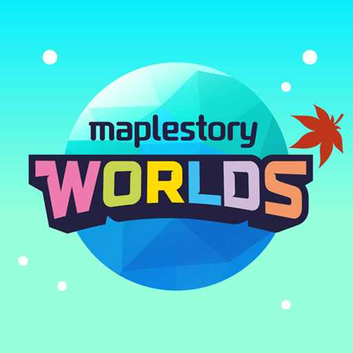
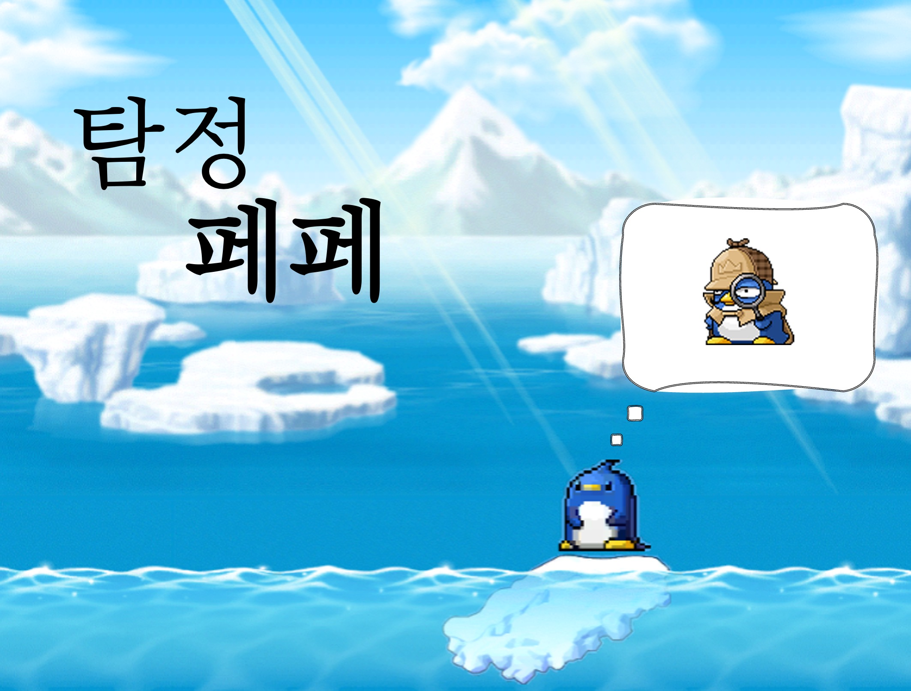
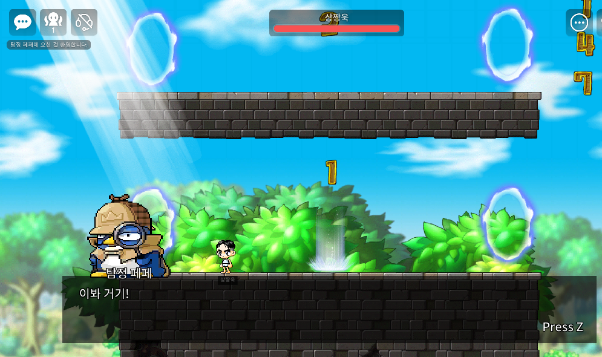

# MSW Super Hackaton
MapleStory Worlds X Super Hackathon 2022 (개발 + 기획 트랙팀)

## 팀원
- [세종대학교 전자정보통신공학과 박상욱 (게임 스토리 기획 및 개발)][1] 
- [세종대학교 컴퓨터공학과 이규리 (게임 디자인 및 개발)][2] 
- [세종대학교 컴퓨터공학과 이은주 (게임 스토리 기획 및 개발)][3]

## Platform
 

## Game Play

   
  <b>▲ 탐정 페페 게임 링크</b>

## Game Intro

  
  <b></b>
  <c></c>
  <d></d>
  <e></e>
  <f></f>

메이플스토리를 오래 즐겨온 코어 유저들의 흥미를 끌었던 이벤트 명탐정 페페를 기억하는 유저들이 있습니다. 
이러한 코어 유저들의 향수를 불러올 수 있는 명탐정 페페와 함께 진정한 탐정으로 거듭납니다. 
또한 지루하지 않게 스토리를 넣어 다양한 유저들이 즐길 수 있게 만들었습니다.

새로운 탐정이 되기 위해 거쳐야 할 총 5단계의 과정이 플레이어를 기다리고 있습니다. 
스토리를 진행하면서 스토리 진입 전 1개, 스토리 속에서 4개의 각기 다른 게임을 넣어서 
게임의 다양성을 넓이고자 했습니다.

새로운 탐정이 되기 위해 명탐정 페페의 조수가 되는 과정부터 총 5단계를 거쳐 명탐정이 되기 위해 
필요한 물품을 얻는 과정을 거치면서 플레이어가 명탐정으로 거듭나는 목표를 가지고 있습니다. 
단계별로 한 단계씩 해결할 때마다 다음 단계가 해금되어 그 다음 단계를 도전 할 수 있어 
플레이어의 목표를 고취시킵니다.  
단계마다 다른 게임을 배치해서 플레이어의 흥미를 이끌 수 있게 하였습니다.

타켓군은 주로 페페를 기억하고 있는 코어 유저들과 스토리 게임을 좋아하는 유저입니다.  
다른 게임과는 달리 스토리가 있어 스토리에 몰입할 수 있어 게임을 더 오래 지속할 수 있게 합니다. 

[1]: https://github.com/sw0501
[2]: https://github.com/sw0501
[3]: https://github.com/sw0501
